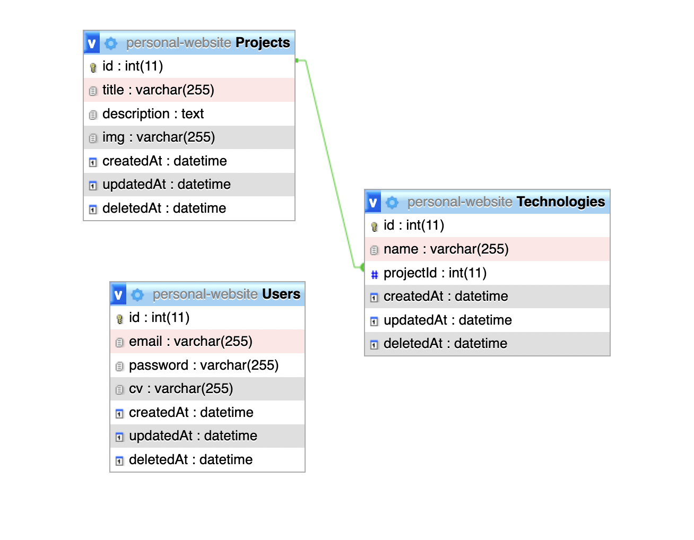

# Personal Website API

This is the RESTful API of the my personal website that's written in the Nest js.

## Installation 

- Make sure you had clone this repo
- Copy environment from `.env.example` to `.env`
- Configure your `.env` file according to your MySQL credentials
- Open your terminal in this project and run 

	```bash
	npm install
	```

## How To Run This RESTful API

- Create The Personal Website Database

	```bash
	CREATE DATABASE personal-website CHARACTER SET utf8 COLLATE utf8_general_ci;
	```

- Run On Development

	```bash
	npm run start:dev
	```

- Run On Production

	```bash
	npm run start
	```

## Entity Relationship Diagram (ERD)

[](screenshoot/ERD.png)

## API SPECS

- POST `/api/v1/auth/register` Route for register new user

	Request Body

	```
	{
		"email": "your email",
		"password": "your password",
		"repeatPassword": "your repeat password"
	}
	```

- POST `/api/v1/auth/login` Route for login

	Request Body

	```
	{
		"email": "your email",
		"password": "your password"
	}
	```
- POST `/api/v1/auth/access-token` Route for generate the access token

	Request Body

	```
	{
		"refreshToken": "your refresh token"
	}
	```
- POST `/api/v1/user/password` Route for sending forgot password link to an email

	Request Body

	```
	{
		"email": "your email"
	}
	```

- PUT `/api/v1/user/password` Route for reset the password

	Request Body

	```
	{
		"password": "your new password",
		"repeatPassword": "repeat your new password"
	}
	```

- GET `/api/v1/user/cv` Route for downloading a cv

- PATCH `/api/v1/user/cv/:id` Route for uploading a cv

	Request Body (Multipart/Form-Data)

	```
	{
		"cv": "blob file (pdf file only)"
	}
	```
- GET `/api/v1/project/:id` Route to get a detail of project

- GET `/api/v1/projects` Route to get all projects

	Request Query

	```
	{
		"page": "the page in number",
		"limit": the limit in number"
	}
	```

- POST `/api/v1/project` Create a Project

	Request Body (Multipart/Form-Data)

	```
	{
		"title": "project title",
		"description": "project description",
		"technologies": "technologies",
		"img": "blog image"
	}
	```

- PATCH `/api/v1/project/:id` Generate a Text

	Request Body (Multipart/Form-Data)

	```
	{
		"title": "project title",
		"description": "project description",
		"technologies": "technologies",
		"img": "blog image"
	}
	```

- DELETE `/api/v1/project/:id` Route for deleting a project

## License
[MIT](https://choosealicense.com/licenses/mit/)